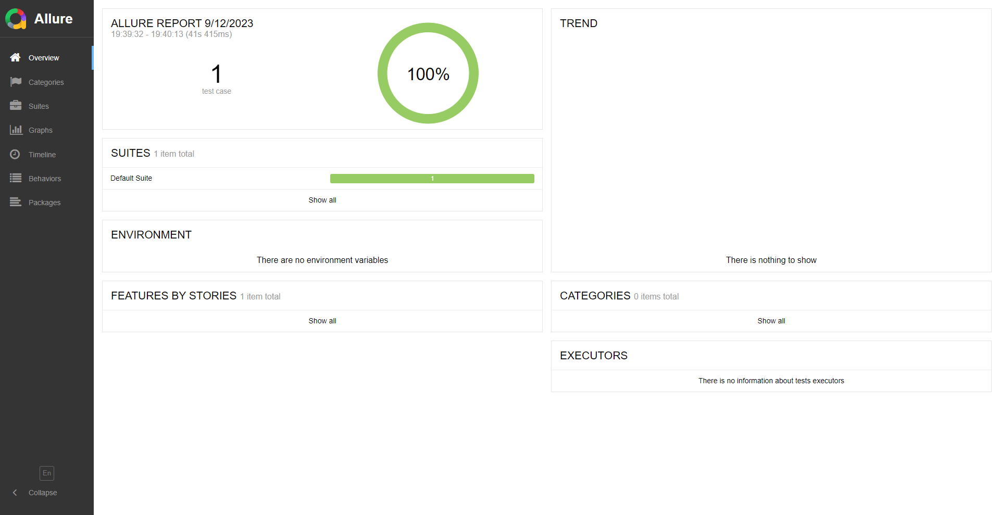

# abstracta_jm project

This is a Automation Framework project created using Selenium in Java

Created by:

- **Name:** Julio Marquez
- **Email:** juliocmrqzweb@gmail.com

## Description

It's created using the Singleton design pattern in Java in which I instance the driver in a global point of access.
It uses the Page Object Model Paradigm in which every page is considered a different object which can extend a page base
with all the available methods to use in every page.

It also has the possibility to create reports using allure



```java
public class PageBase {}
public class MLMainPage extends PageBase {}
public class MLResultsPage extends PageBase {}
```

## Dependencies

- **webdrivermanager**:
    - Version: 5.5.3
    - Description: WebDriverManager is used to automate the management of WebDriver binaries.

```xml

<dependency>
    <groupId>io.github.bonigarcia</groupId>
    <artifactId>webdrivermanager</artifactId>
    <version>5.5.3</version>
</dependency>
```

- **selenium-java:**
    - Version: 4.7.2
    - Description: Selenium is a powerful tool for controlling a web browser through programs and performing browser
      automation.

```xml

<dependency>
    <groupId>org.seleniumhq.selenium</groupId>
    <artifactId>selenium-java</artifactId>
    <version>4.7.2</version>
</dependency>
```

- **testNG:**
    - Version: 7.8.0
    - Description: TestNG is a testing framework inspired from JUnit and NUnit but introducing some new functionalities
      that make it more powerful and easier to use.

```xml

<dependency>
    <groupId>org.testng</groupId>
    <artifactId>testng</artifactId>
    <version>7.8.0</version>
    <scope>test</scope>
</dependency>
```

- **allure-testng:**
    - Version: 2.24.0
    - Description: Allure TestNG is a test report framework that provides clear graphical reports, history trends, and
      various analytics capabilities.

```xml

<dependency>
    <groupId>io.qameta.allure</groupId>
    <artifactId>allure-testng</artifactId>
    <version>2.24.0</version>
</dependency>
```

## Usage

1. Clone this repository
2. Set up your Selenium tests using the provided dependencies.
3. Write your Selenium test scripts.
4. Run your tests.